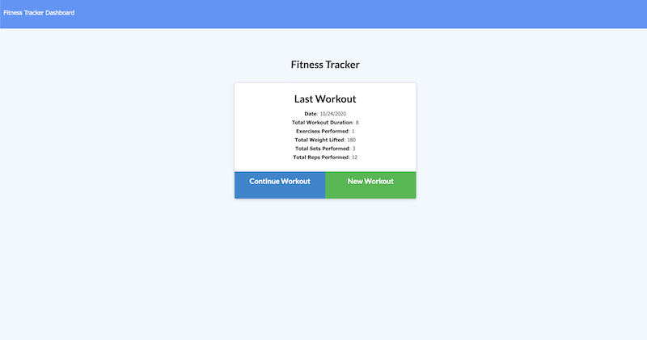
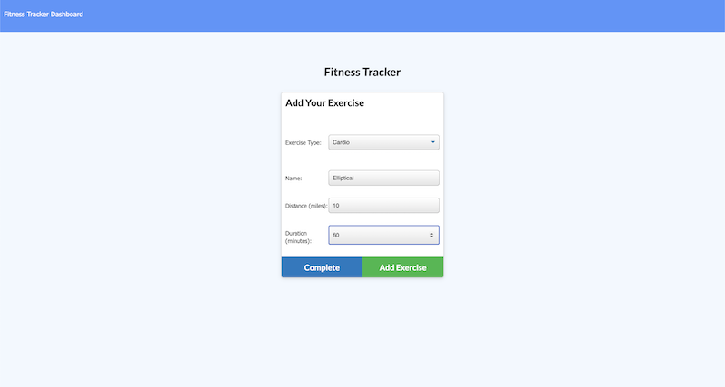
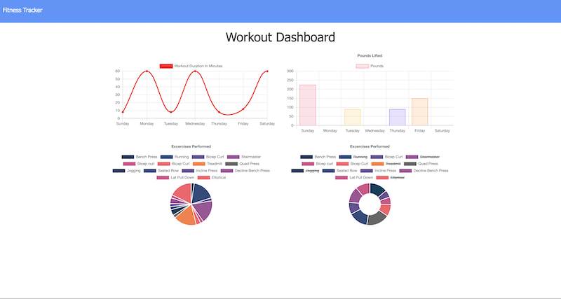

# Fitness Tracker

## Introduction
This is a workout tracking application that allows users to create and edit workouts. The workout data is stored in a Mongo database system where it can be retrieved for viewing on a statistics page.

 
Gif of app functionality

## Technologies used
* HTML
* CSS
* Javascript
* Express
* NodeJS
* MongoDB
* Mongoose
  
 

## Usage

The Fitness Tracker can be utilized by users in order to keep track of workout progress. Users can create and add exercises to a workout. The data is then stored in a Mongo database and displayed in a stats page for users to keep track of their progress. The application divides exercises into two types: resistance and cardio. The stats page has graphs and pie charts to easily view progress for both types over a 7 day period. A video demonstration of the functionality of the application can be found [here](https://youtu.be/rr_bbYyAYlw).

 

## Screenshots

 
Home page

 
 

 
Add an exercise to a new or existing workout

 
 

 
Statistics page showing exercises across every day of the week

 
 

## Contact Information
If you have questions about the application or contributions, I can be contacted via email at:
<maynperalta@gmail.com>
 